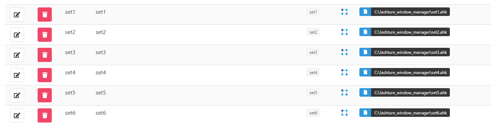

# Jashture Window Manager

**"J_ash_ture"** Window Manager for **`Windows`** : **A window management system using mouse gestures and keyboard controls for efficient window management.**

There are **2** types of window manager -**Tiling** window manager & **Stacking** window manager

#### **Tiling** Window Manager:

- **✔️Automatic Arrangement**  
- **✔️Keyboard-Centric** 
- **✔️Fast Window Parsing** 
- **❌Waste of focus & Space**

#### **Stacking** Window Manager:

- **✔️Full Space Focus** 
- **✔️Mouse-Centric** 
- **❌Manual Window Management** 
- **❌Late Window Parsing**

#### **Jashture** Window Manager:

- **✔️Full Space Focus**
- **✔️Fast Window Parsing**
- **✔️Both Mouse and Keyboard Centric**
- **✔️Easy to Use**
 

## Preview

 

## Mouse and keyboard

Insisting on a **fully keyboard-based** system is a bit of a **joke** —nobody operates solely with a keyboard. I mean, who can resist the efficiency of a mouse, especially for tasks like **copy-pasting outside of text editors**? Even the most productive coders take a moment to click because, let's face it, coding is more about searching and problem-solving than lightning-fast typing, contrary to what **movies** depict.

On the flip side, relying solely on a **mouse** for everything is downright **boring and unproductive**. Constantly clicking through the navbar to switch windows? That's a productivity nightmare.

What we really need is a **sweet combination** of both. A system where you can seamlessly switch between mouse and keyboard as the **situation demands**. That's the sweet spot for **productivity** — keeping things efficient without sacrificing the ease of a **good ol' mouse click**.
 
 

## Components

Dividing the system into **two** distinct components — **tools** and **scripts**
 

### Tools - 4

**1.** AutoHotKey  
**2.** StrokePlus.net  
**3.** Switcheroo  
**4.** Ueli  

### Scripts - 17

**1.** Gesture Script x (7)  
**2.** Set Script x (6)  
**3.** Window Title Script x (1)  
**4.** F1 & F2 Script x (1)  
**5.** Ueli Helper Script x (2)  
 
 

## System Architecture

 
 

## System Details

We can break down the Jashture Window Manager into **👉 4️ main components.**

### **1️⃣ Mouse Control**

- **Set Window Title🔻**
  
    **`Use:`** We have **6 gestures**. Using Ueli, we can easily set and assign each gesture to a new window. Just search with Ueli and set the window title for each gesture.
  
    **`Tools:`** Ueli search, set title scripts, window_titles.txt file.
  
    **`Details:`** In our toolkit, we conveniently utilize a text file named "window_titles.txt" to manage 6 distinct window titles, each corresponding to a specific gesture. We also have 6 “set_title” scripts that take input for 6 titles, enabling us to use Ueli and set window titles using those scripts.

- **Mouse gesture🔻**
  
    **`Use:`** Now that you've assigned titles to your gestures, it's a breeze to use them. Just make the gesture with your mouse, and **voila!** The window you want will pop right up on top. Easy peasy!
  
    ***mouse gesture >> keystroke >> window_title read >> window appears***
  
    **`Tools:`** StrokePlus, gesture_scripts.
  
    **`Details:`** We've configured 6 mouse gestures in StrokePlus software, and each of these gestures triggers a specific custom keystroke on the keyboard. For instance, gestures may correspond to combinations such as Ctrl+Alt+Shift+1, Ctrl+Alt+Shift+2, and so forth.
  
  Upon triggering each keystroke in our set of 6 gestures, individual scripts are activated. Each script is designed to read a specific title from the "window_titles.txt" file. For instance, Gesture Script 1 reads Title 1, Gesture Script 2 reads Title 2, and so forth. As a result, the window associated with the title promptly appears in the screen.

### **2️⃣ Keyboard Control**

- **Window title search🔻**
  
    **`Use:`** If you're at the keyboard, no need to reach for the mouse. Just use Switcheroo, search by window title, and boom! Your window pops right up at the top. Easy and simple!
  
   ***switcheroo search >> window_title >> window appears***
  
    **`Tools:`** Switcheroo. 
  
    **`Details:`** With Switcheroo, a quick keystroke like Alt+Space lets you search for a window by title, bringing it to the front. It's like mouse gesture control but for your keyboard – straightforward and efficient!

### **3️⃣ Switcher**

- **F1 switcher🔻**
  
    **`Use:`** Now pressing the **F1 key** allows you to swiftly switch between the top two windows in the stack. This feature lets you toggle between the current and previous windows seamlessly, enhancing your navigation **speed**.
  
   ***f1 key >> previous window appears***
  
    **`Tools:`** F1 key, F1 key script. 
  
    **`Details:`** Enhancing efficiency in your workspace, we've implemented a “F1_script” for the F1 key, enabling rapid switching between the latest two windows. This means you can seamlessly toggle between the current window and the previous one, putting the focus on the top two windows for optimal workflow management. It's a simple yet powerful feature that contributes to a more streamlined and productive working environment.

### **4️⃣ Helpers**

- **F2 list, ueli helpers🔻**
  
    **`Use:`** We've got more tricks up our sleeve! Hit **F2** to check out your current gesture-assigned window list. Plus, some Ueli_scripts helps with cool keyboard actions like **minimizing** and **closing** windows. It's all about making things quick and easy.
  
   ***f2 key >> show gesture window title list***
  
   ***ueli type “off “ >> close the window***
  
   ***ueli typr “cls” >> minimize all window***
  
    **`Tools:`** F2 script, ueli helper scripts. 
  
    **`Details:`** Our helper scripts add some nifty extras. The “F2_script” lets you check out the window titles from "window_titles.txt." Plus, we've got “scripts” for minimizing and closing windows using keyboard shortcuts, making it super convenient.
 
 

## Installation

  
<strong>1️⃣ Download the release 1.01 "jashture_window_manager.zip" folder and extract it.</strong>

   

  
<strong>2️⃣ Locate the "jashture_window_manager" folder and move it to the `C` drive.</strong>

   

  
<strong>3️⃣ There is a "Tools" folder and a "Config" folder, find four executable files on "Tools" folder: autohotkey, strokeplus, switcheroo, and ueli.</strong>

   

  
<strong>4️⃣ Install AutoHotKey version 1.1.37 --❗use the "express installation" option.</strong>

   

  
<strong>5️⃣ Install StrokePlus -- ❗ensure to select the "Automatically start on login" checkbox during installation.</strong>

   

  
<strong>6️⃣ Install Switcheroo --❗make sure to check the "Startup with Windows" checkbox during the installation process.</strong>

   

  
<strong>7️⃣ Install Ueli.</strong>

   

  
<strong>8️⃣ Now open "StrokePlus".In the Import and Export panel, upload the "StrokePlus config" file.</strong>

   

  
<strong>9️⃣ Open "Ueli settings" from toolbar, navigate to the "general tab", click the three dots, and import settings by uploading the "Ueli config" file from the "Config" folder.</strong>

   

  
<strong>❗❗ If you are already an "ueli" user... you have to add workflows manually to merge with your existing ueli workflows.👉 Please skip this step if you are a new ueli user and dont have any existing Ueli workflows.</strong>

   
  -- 📌 You have to go to Ueli workflows.
   
  -- 📌 You have to add 9 more workflows with your existing ones.
   
   

 
 

  -- 📌 First is a "jashture" workflow -- for all the "f1,f2 and gesture scripts" run (9 scripts -- 1 f1, 1 f2, 7 gesture). You have to enter the file path for these scripts.
   
   

 
 

  -- 📌 another is 6 "set" workflow -- for all the "set" scripts (6 scripts -- set1, set2, set3, set4, set5, set6). You have to enter the file path for these scripts.
   
   

 
 

  -- 📌 then a "off" workflow -- for closing window scripts (1 script -- ueli_helper_close_window). You have to enter the file path for these scripts.
   
   

 
 

  -- 📌 last is a "cls" workflow -- for minimizing script (1 script -- ueli_helper_minimize_all_window). You have to enter the file path for these scripts.
   
   

 
 

  -- 📌 these are the 9 workflows for 17 scripts -- "jashture" workflow has 9 scripts, 6 "set" workflows each with a set_script, 1 off workflow, 1 cls workflow. 
   
   

 

  
<strong>1️⃣0️⃣ After completing this, Press "Ctrl+Space" for ueli search bar, type "jashture" and hit enter in Ueli. It will start all the scripts for the window manager. You can see on toolbar.</strong>

   

  
<strong>1️⃣1️⃣ Pin your favourite app / browser on 3rd position of the taskbar. Now you can use the "gesture_main" fixed gesture for that app.</strong>

   

  
<strong>1️⃣2️⃣ Your setup is now complete.</strong>

   

 
 

## User Manual

  
<strong>1️⃣ First check if "StrokePlus" is active; it should automatically run each time you start your PC. You can ensure it on the toolbar area.</strong>

   

  
<strong>2️⃣ Then ensure that "Ueli" is running. You can ensure it on the toolbar area.</strong>

   

  
<strong>3️⃣ Now press Ctrl+Space to open Ueli search, type "jashture," and press Enter.</strong>

   

  
<strong>4️⃣ Now you can press F2 to view the list of window titles with gestures.</strong>

   

  
<strong>5️⃣ Use Alt+Space in Switcheroo to see all opened window names.</strong>

   

  
<strong>6️⃣ Now in Ueli you can assign window title for each gestures. Search for set1, set2, set3, set4, set5, set6 + enter and enter the window title names. (you can use only a full word for partial match). Remember set1 is for gesture1, set2 is for gesture2, set3 is for getsure3 and so on...</strong>

   

 

 

 

  
<strong>7️⃣ Voila! now just use right-mouse-click + gesture for window management. Remember there are 7 gestures -- 6 title set gestures, 1 fixed main gesture. For example : down, 45 degree up, right, left and so on. </strong>

   

  
<strong>8️⃣ For keyboard, use Alt+Space to switch between windows using switcheroo search with window title.</strong>

   

  
<strong>9️⃣ The most important feature is F1 switch. Pressing F1 you can switch between current and previous app.</strong>

   

  
<strong>1️⃣0️⃣ There are 2 helper command for ueli. One is "cls" -- to minimize instantly all the opened applications. Another is "off" -- it will close the current application.</strong>

   

 

## Uninstalling

❗Just delete the "jashture_window_manager" from C drive & Uninstall 4 tools. Easy....
 
 

## Appreciations

- **AutoHotKey:** Gratitude for empowering automation with its versatile scripting capabilities.❤️[🔗](https://github.com/AutoHotkey/AutoHotkey)
- **StrokePlus:** Appreciation for enhancing user experience through intuitive stroke gestures.❤️[🔗](https://www.strokesplus.net/)
- **Ueli:** Thanks for providing an efficient and customizable application launcher for seamless navigation.❤️[🔗](https://github.com/oliverschwendener/ueli)
- **Switcheroo:** Recognition for simplifying window management with its user-friendly interface.❤️[🔗](https://github.com/kvakulo/Switcheroo)
